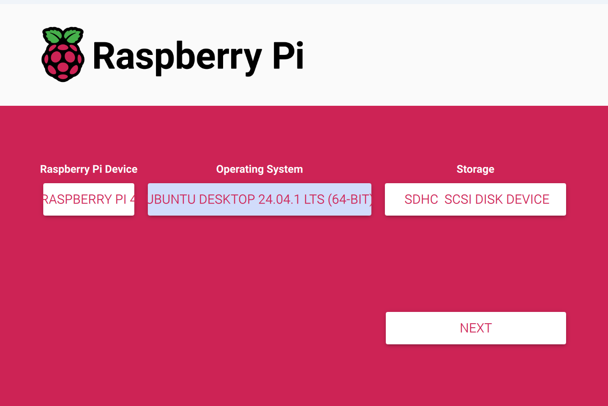

### 1. Start Raspberry imager  
### 2. Sett inn SD kortet ditt inn i maskinen
### 3. Da vil du få ett vindu slik som dette 

### 4. Velg Dine instillinger i forhold til hvilken Raspberry Pi du har, slik gjør jeg dette
### 5. Så overskriver du det du har på kortet om det er tilfellet ellers bare fortsetter du
### 6. Nå som du har overskrevet det du hadde kan du fjerne SD kortet fra maskinen
### 7. Nå kan du plassere SD kortet inn i Raspberry Pi igjen
### 8. Så er det å starte opp Raspberry Pien å gjøre systemoppsettet
### 9. Først så velger du språket deretter så velger du tastatur språkett etter dette så velger du hvilket trådløs internette
 